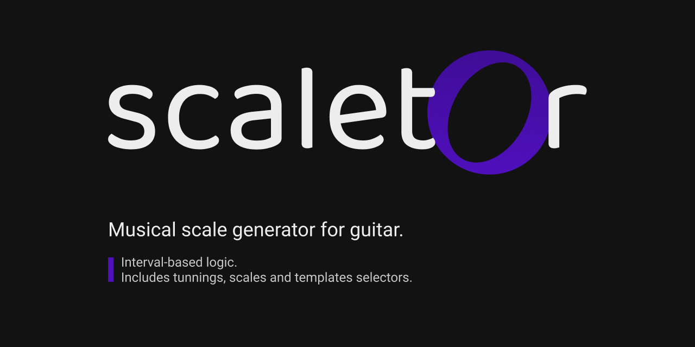

# scaletor

This is a project of a generator of musical scales for guitar, you can use it on [this page](https://fdrandolfi.github.io/scaletor/).

## Usage
Run `npm install` for Install all dependencies.

### Development
Run `npm run dev` for wake up *webpack-dev-server* and go to `localhost:3000`

### Production
Run `npm run prod` for generate builds on `/dist`.

### Start
Run `npm run start` for wake up server on `localhost:8080`.

### Watch
Run `npm run watch` for wake up all servers & listen the builders for changes on realtime.

---

#### Author
© Copyright 2020 Felipe Randolfi
